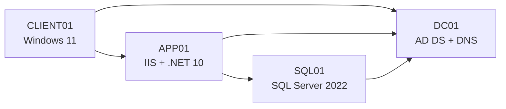
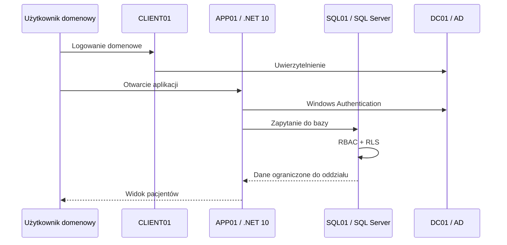

# Architektura środowiska — HospitalAccessControl

## Domena

```text
hospital.local
```

## Adresacja

```text
Sieć: 192.168.50.0/24
Brama: 192.168.50.1
DNS: 192.168.50.10
```

## Maszyny

| Maszyna | IP | System | Rola |
|---|---:|---|---|
| `DC01` | `192.168.50.10` | Windows Server 2022 | Active Directory + DNS |
| `SQL01` | `192.168.50.20` | Windows Server 2022 | SQL Server 2022 Developer |
| `APP01` | `192.168.50.30` | Windows Server 2022 | IIS + .NET 10 |
| `CLIENT01` | `192.168.50.40` | Windows 11 | Klient testowy |

## Diagram logiczny



## Przepływ dostępu


