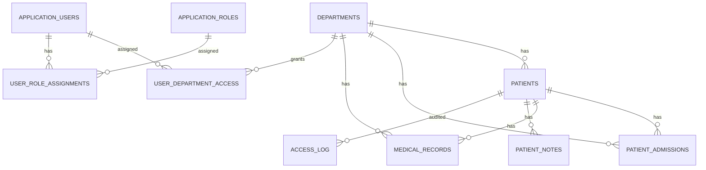

# Model bazy danych

## Baza

```text
HospitalAccessControlDb
```

## Schematy

- `dictionary`
- `medical`
- `security`
- `audit`
- `app`

## Tabele

### Schemat `dictionary`

- `dictionary.Departments`
- `dictionary.Roles`
- `dictionary.PatientStatuses`
- `dictionary.MedicalRecordTypes`

### Schemat `medical`

- `medical.Patients`
- `medical.PatientAdmissions`
- `medical.MedicalRecords`
- `medical.PatientNotes`

### Schemat `security`

- `security.ApplicationUsers`
- `security.UserDepartmentAccess`
- `security.UserRoleAssignments`

### Schemat `audit`

- `audit.AccessLog`
- `audit.SecurityEvents`

## Diagram ERD



## Założenie RLS

Mechanizm Row-Level Security filtruje dane według `DepartmentId` oraz mapowania aktualnego użytkownika w tabeli `security.UserDepartmentAccess`.

```text
Aktualny użytkownik domenowy
  ↓
security.ApplicationUsers
  ↓
security.UserDepartmentAccess
  ↓
DepartmentId
  ↓
medical.Patients.DepartmentId
```
