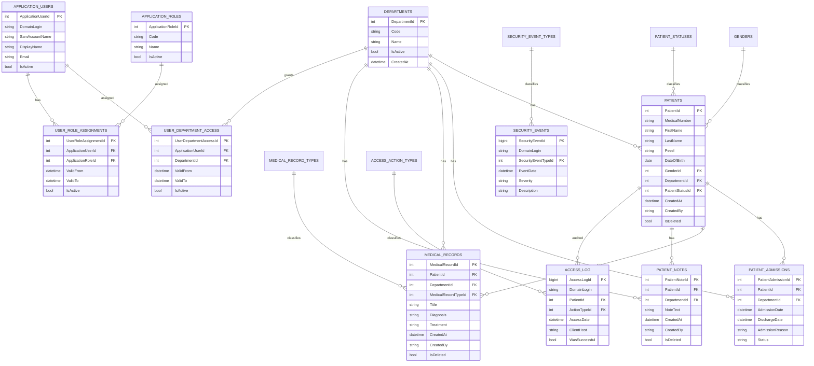

# Relacje i diagram ERD

## Relacje główne

```text
dictionary.Departments 1 --- * medical.Patients
dictionary.Departments 1 --- * medical.PatientAdmissions
dictionary.Departments 1 --- * medical.MedicalRecords
dictionary.Departments 1 --- * medical.PatientNotes
dictionary.Departments 1 --- * security.UserDepartmentAccess

dictionary.ApplicationRoles 1 --- * security.UserRoleAssignments

security.ApplicationUsers 1 --- * security.UserDepartmentAccess
security.ApplicationUsers 1 --- * security.UserRoleAssignments

medical.Patients 1 --- * medical.PatientAdmissions
medical.Patients 1 --- * medical.MedicalRecords
medical.Patients 1 --- * medical.PatientNotes
medical.Patients 1 --- * audit.AccessLog
```

## Diagram ERD — Mermaid


